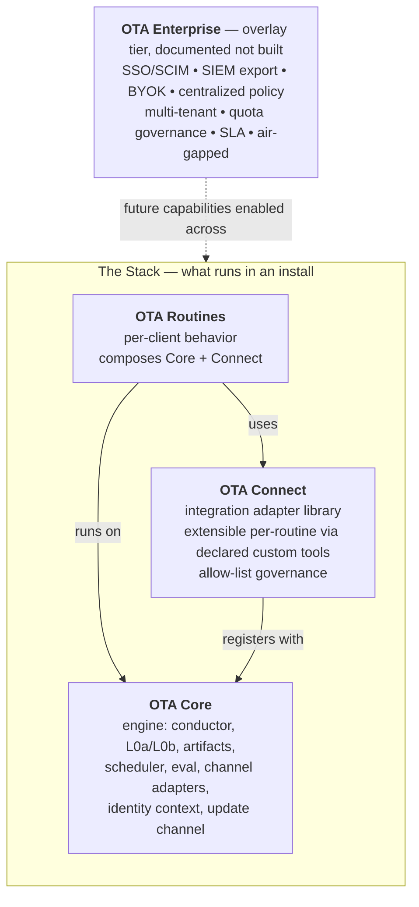

# One True Agent — Architecture (Working State)

_Last updated: 2026-05-18_

This is the current canonical state of OTA's architecture. **Four components on one codebase:** OTA Core (engine), OTA Connect (integration adapter library + capability vocabulary), OTA Routines (per-client behavior), and OTA Enterprise (overlay tier — documented, not built). See Section 1 for the component model. Same codebase ships as edition-gated builds: **OTA-Core** (personal + SMB, Upwork-style single-tenant deliveries) and **OTA-Enterprise** (additive seam implementations; SCIM, RBAC, vault-backed secrets, multi-tenant, HA, OTLP, SIEM-shipping). For v0.1 the deployment surface is **Mode 2 (VPS in client account) only** — Mode 1 (Local) explicitly rejected; Mode 3 (Managed by Omar) deferred to v0.3+. Markdown-first routines with a Python policy layer for hard constraints. Pluggable seams for identity, secrets, audit, LLM provider, routine source, integration registry, observability.

**Source-of-truth peer documents:**

- [`contracts.md`](contracts.md) — the five canonical contracts (`llm_requirements`, audit event schema, routine source manifest, integration registry, deployment configuration).
- [`vocabulary/`](../vocabulary/) — capability vocabulary specs (`_types.md`, `messaging.md`, `email.md`, `_roster.md`, `_template.md`). The capability layer of OTA Connect is implemented against these specs. Updates governed by Section 3 Connect sub-sections below.
- [`docs/build-plan-v0.md`](build-plan-v0.md) — active first-client MVP build plan covering scope, sequencing, tech stack, and operational model.

This file is the architectural overview; the peer documents above carry schema-level and build-level detail. Update all three as decisions evolve.

---

## Contents

1. [Component model](#1-component-model) — four-component overview (Core / Connect / Routines / Enterprise), diagram, build order.
2. [Layered architecture](#2-layered-architecture) — runtime topology and cross-cutting concerns.
3. [Layer details](#3-layer-details) — Access, Identity, Conductor, Routines, Automation, Connect (incl. namespace, vocabulary governance, binding layer).
4. [Context tiering](#4-context-tiering-the-five-levels) — L0a/L0b/L1–L4, storage vs. injection shape, prompt caching.
5. [Cross-routine handoff — Artifacts model](#5-cross-routine-handoff--artifacts-model) — typed handoffs, stale TTL.
6. [Human-in-the-loop gates](#6-human-in-the-loop-gates) — progressive trust, three approval modes, gate-the-delta.
7. [Test harness — evals](#7-test-harness--evals-not-unit-tests) — snapshot, property, replay; lifecycle wiring.
8. [Operational primitives](#8-operational-primitives-the-missing-pieces) — retry, concurrency, cost, audit, bootstrap, reset.
9. [Update Lifecycle](#9-update-lifecycle) — snapshot matrix, source / state / manual migration, per-client pinning, security SLA, canary, stale-install policy, change reports.
10. [Deployment modes](#10-deployment-modes) — Mode 2 v0.1 default; Mode 1 rejected; Mode 3 v0.3+ future.
11. [IP protection model](#11-ip-protection-model) — revocable channel, license, Mode 3 pitch.
12. [Private routine channel](#12-private-routine-channel) — pull-based delivery, JWT auth, revocation, key rotation.
13. [Markdown / Python boundary](#13-markdown--python-boundary) — determinism vs. judgment; framework rules soft vs. hard.
14. [Seam architecture](#14-seam-architecture) — eight pluggable seams, edition gating, Enterprise overlay.
15. [Contracts](#15-contracts) — index of the five canonical contracts (plus vocabulary specs as peer contracts).
16. [Cross-contract invariants](#16-cross-contract-invariants) — the eleven structural rules.
17. [Operator notification routing](#17-operator-notification-routing) — urgency matrix, rate limiting, acknowledgement.
18. [Open questions](#18-open-questions) — what's still being decided.
19. [Out of scope](#19-out-of-scope-for-now) — deliberately not building.

---

## 1. Component model

OTA is four components on one codebase. Three sit in the runtime stack; one is a cross-cutting overlay tier.



| Component | Axis | Role | Cadence |
|---|---|---|---|
| **OTA Core** | Stack | Framework engine — conductor, L0a/L0b, context tiering, artifact store, scheduler, eval lifecycle, channel adapters, update channel. | Evolves slowly. Touched only for framework-level work. |
| **OTA Connect** | Stack | Integration adapter library + capability vocabulary. Routines invoke `ota_connect.<capability>.<verb>(...)` — a stable contract layer between the agent (routine) and the integration adapter (Slack, Gmail, etc.). See Section 3 Connect subsections for namespace + naming convention, vocabulary governance, and binding layer details. Capability vocabulary specs live in [`vocabulary/`](../vocabulary/). **Connect-as-standalone-product is gated work — see below.** | Vocabulary grows slowly (intent-driven, two-track cadence). Adapters grow continuously with engagements. The moat. |
| **OTA Routines** | Stack | Per-client behavior. Composes Core primitives and Connect adapters. Delivered via the signed channel. | Every engagement. |
| **OTA Enterprise** | Overlay | Compliance, identity, governance, scale features for selling upmarket. Documented in this architecture (Section 14 Seam architecture, Contract E deployment configuration) but **not built**. Core stays open for it — no hardcoded single-user assumptions, audit log SIEM-shippable, policy enforcement centralizable, credentials always via Core's secret store. | Documented as a future tier. Build when a paying enterprise customer asks. |

**Key contracts between components:**

- **Core ↔ Connect:** connectors register with Core's integration registry (Contract D); Core enforces auth, rate limits, audit, schema, side-effect classification.
- **Connect ↔ Routines:** routines extend connectors via declared custom tools (markdown frontmatter), bounded by the connector's `allowed_extension_paths` policy. Routines never bypass — they extend.
- **Enterprise → Stack:** enables features at the right layer (SSO at Core's access layer, BYOK at Core's secret store, SIEM export at Core's audit trail). Does not introduce a new execution layer; activated via seam swap (Section 14).

**Build order:** Core spec → Connect adapters (generic first: HTTP, SQL, webhook; then top specific) → authoring CLI for Routines → Enterprise (when a paying enterprise customer requests it).

**Connect-as-standalone-product — gated future state.** Build Connect with clean boundaries from day one (versioned vocabulary, no internal back-doors that bypass the capability layer, schema-validated bindings). **Do not invest in standalone-product infrastructure** (public docs, SDK polish, conformance test suite, adapter scaffolding CLI, marketing site, governance model) **until at least one external party (client, dev team, framework) has explicitly asked for it.** Single trigger, no calendar date. The discipline of "this could be a standalone product later" is what keeps the framework from cutting corners; the discipline of "don't ship it until pulled" is what keeps the consultancy focused.

---

## 2. Layered architecture

```
USER
  ↓
Access Layer            — channel adapters (Telegram, web, CLI, iOS Shortcut, voice, email)
  ↓
Identity Context        — always-on prefix (user.md, voice.md, principles.md, relationships.md)
  ↓
Conductor               — intent routing + confidence fallback + planning-tier selection
  ↓
Routines                — branches/systems with declared knobs, scoped state, scoped identity
  ↓
Automation              — schedules + event hooks (with on_missed policy)
  ↓
Integrations            — canonical registry, per-routine credential binding, polling-first
  ↓
External systems        — Slack, Notion, GCal, Gmail, etc.
```

**Cross-cutting:**

- **Context tiering** — five levels: L0 rules → L1 identity → L2 routine startup → L3 RAG → L4 durable state.
- **Prompt caching** — concatenated L0+L1 prefix cached via Anthropic prompt caching; cache hit rate depends on cadence (cold-miss penalty for routines firing slower than cache TTL).
- **Authoring inheritance** (build-time) — global templates → per-client overrides → packaged deliverable.
- **Observability** — what-just-happened feed, action receipts with undo, trust accumulator per routine.

---

## 3. Layer details

### Access Layer

Thin channel adapters that normalize any chat surface into a canonical envelope before the conductor sees it:

```
{ user_id, channel, raw_text, attachments, thread_id, timestamp }
```

- **Default channels:** Telegram (works in both deployment modes via outbound polling), CLI, web on localhost or behind a domain.
- **Output is symmetric:** routines emit `{ channel_hint, content, attachments }` and the access layer routes it back.
- **Routines declare `delivery_policy`:** `respond_on_origin | fixed_channel | user_default`.

### Identity Context

**Two distinct identity concepts, separate seams:**

- **L1 identity context** (this section) — markdown content the LLM reads as prompt prefix: who the operator is, voice, principles, decoded shorthand. User-authored or agent-written via tool calls. Lives in the framework's filesystem.
- **Operational identity** — the runtime principal performing actions, used for gate routing, audit `principal` field, and IdP group resolution. Provided by the **Identity Provider seam** (Contract E `providers.identity`). Core defaults to `local` (single operator); Enterprise adds `oidc_enterprise` and `saml` with SCIM provisioning and group claims.

The two never share storage. Gates and audit events reference operational identity (`principal:operator`, `group:finance-leads`); routine prompts inject L1 identity content. Conflating these is the regret-level architectural mistake — see [Contract E §Operator bootstrap](contracts.md#operator-bootstrap) and cross-contract invariant #10.

The L1 files:

| File | Contents | Edited by | Tier |
|---|---|---|---|
| `user.md` | Role, location, preferences | User only | L1 (markdown) |
| `voice.md` | Tone, cadence, banned phrases (per-channel optional) | User only | L1 (markdown) |
| `principles.md` | Hard rules (e.g. "95–100% certainty or ask") | User only | L1 (markdown) |
| `relationships.md` | Decoded shorthand, nicknames, context per person | Agent + user (via tool call) | **L4 with MD projection** |

**Classification rule:** any file routines write to is L4 (SQLite-backed) with a markdown projection — never L1. Only files exclusively user-edited stay L1. This prevents concurrent-write races on identity files: routines mutate the SQLite row through the L0b queue; the MD is a rendered view the user can read but not directly edit. User additions go through the agent (tool-call path) or a write-locked editor endpoint.

Each routine declares `requires_identity: [voice, principles, relationships]` so it only loads what's needed.

### Conductor

**Tiered routing** — semantic router first, LLM fallback:

1. Semantic router (local vector index — FAISS / sqlite-vec / lancedb) classifies intent with a confidence score.
2. Confidence above threshold → route directly, skip the LLM entirely (sub-100ms common path).
3. Below threshold → fall back to LLM conductor (Haiku-tier) for the long tail.
4. Below LLM confidence threshold → ask user "I think you want X — yes?"

**Learn-from-corrections loop (with five-layer defense against poisoning).** Successful LLM-fallback routings become positive embedding samples; user corrections become negative samples. Without learning the router rots as new routines are added — but naïve collection poisons the index, and one bad correction or routine rename can make the router fast and confidently wrong with no LLM fallback. Defense applied in order:

1. **Deduplication threshold.** Don't add to the index on the first correction. Require N similar corrections (e.g. 3 within 7 days) before promoting a sample.
2. **Sandboxed pre-commit eval.** Every proposed index change runs against a fixed router eval suite. Fail → reject the update, log it.
3. **Auto-rollback.** If post-commit router accuracy on the known-good test set drops below threshold, revert.
4. **Drift monitoring.** Track the gap between router confidence and LLM-fallback agreement rate. Rising confidence + falling agreement = silent poisoning. Alert.
5. **Consultant notified on failures, not approvals.** Omar reviews rejected and rolled-back updates only — happy-path commits are automated. Scales to N clients because only exceptions cross the review queue.

**Capability-based matching** — routines declare capabilities they provide; the router/LLM matches on capabilities, not hard-coded names (avoids name-locked dependencies).

**Pre-flight context resolution** — the conductor's routing output is a declared load manifest, not a free-form handoff:

```yaml
route_to: routines/morning_brief
load:
  identity: [voice, principles]
  startup_context: [last_brief_summary.md, recent_topics.md]
  integrations: [slack, gmail]
  state_shards: [morning_brief.state]
```

Framework loads exactly that set deterministically; no LLM judgment in the loading step. Same principle extends to integration auth — defer OAuth refresh until a routine declares it needs the integration.

### Routines

Pre-built bundles. User-facing unit. Composed of skills + systems.

**Vocabulary:**
- **Skill** — atomic, one job, ~≤200 lines of markdown.
- **System** — a chained sequence of skills with its own state.
- **Routine** — system + automation + knobs + identity scoping (the user-facing unit).

**Routine declares (frontmatter)** — see [Contract C §Routine bundle manifest](contracts.md#routine-bundle-manifest-routineyaml) for the full schema:

- `framework_compat` semver range (replaces older `min_aos`/`max_aos`).
- `knobs[]` — typed knob declarations for auto-generated tuning UI (Contract C knob type taxonomy).
- `dependencies.routines[]`, `dependencies.integrations[]`, `capabilities.provides/consumes`.
- `dependencies.integrations[].binding_level` — `routine_exclusive` \| `client_shared` \| `identity_bound` — drives credential revocation semantics on emergency kill.
- `dependencies.integrations[].on_emergency_kill` — `burn_credential` \| `revoke_routine_access` \| `revoke_routine_grant`, paired with binding_level.
- `dependencies.integrations[].scopes[]` — validated against the integration's `scope_vocabulary` (Contract D); virtual credential scoping enforced at SecretsProvider boundary.
- `llm_requirements` — see Contract A; capability negotiation (`required`, `preferred`, `forbidden_without`), cost tier, PII categories, data residency, cache pool, budget.
- `automation` — cron + event hooks with `on_missed` policy.
- `gates[]` — declared human-in-the-loop steps with three approval modes (`approve` / `tune_and_approve` / `approve_and_remember`) and per-routine similarity functions.
- `artifacts.stale_artifact_ttl` — auto-expire emitted artifacts after this window if unclaimed (default 4h); prevents downstream routines from waking on stale data from a killed parent.
- Signed with Ed25519; bundle hash + per-file SHA-256 verified at load.

### Automation

- Cron expressions + event hooks (artifact-arrival, integration events).
- Each routine declares `on_missed: { strategy: coalesce | skip | run_all | run_if_within, tolerance: 4h }` — critical for local-mode reliability.
- Conductor enforces locks (integration-level, branch-level) before firing concurrently.

### Connect (integration layer)

OTA Connect is the integration adapter library — the bottom of the runtime stack. It owns every external system the framework touches: tool-specific adapters (Hubspot, Slack, Gmail, GCal, Notion, etc.) and generic adapters (HTTP/webhook, SQL/JDBC, IMAP/SMTP, CSV/S3, MCP-server-as-connector). The integration registry is a first-class artifact declared in [Contract D](contracts.md#contract-d--integration-registry). Each registered connector declares its auth styles, supported binding levels, scope vocabulary, side-effect classification per operation, revocation endpoints, egress patterns, rate limits, webhook receivers, and `allowed_extension_paths`.

- **Signed registry manifest** — pulled from the Agentikey channel (built-in connectors) or client-specific channels (custom internal APIs). Same Ed25519 signing + kill-list polling model as routines.
- **Per-routine credential binding** with virtual scoping (Contract C §Virtual credential scoping). A physical token with N scopes presents only the routine's declared subset; L0b enforces at every integration call. Confused-deputy bugs impossible by construction.
- **Side-effect classification** — `read_only` / `stateful_safe` / `stateful_destructive`. `stateful_destructive` operations auto-gate by default and promote `routine.run_terminated_incomplete` severity when they complete during abnormal termination.
- **Revocation cascade** — when a connector is `emergency_killed`, every dependent routine triggers its declared `on_emergency_kill` action, AND L0b applies a global egress block for the connector's `egress_patterns` as secondary hard-kill defense.
- **Polling-first** by default; webhook receivers opt-in via Contract D `webhooks[]`. Webhook port/TLS/proxy config in Contract E `network.webhook_receiver`. Required public URL only matters for non-outbound-only deployments.

**Extension model — routines extend connectors, never bypass them.** A routine can add API methods to an existing connector via declared custom tools in frontmatter:

```yaml
# routine frontmatter
extends_connection: hubspot
custom_tools:
  - name: get_custom_report
    method: GET
    path: /reports/{report_id}
    auth: hubspot.oauth_token
    schema: schemas/hubspot_custom_report.json
```

The framework generates the tool binding, makes it available to the routine's LLM calls, validates input/output against schema. The connector's `allowed_extension_paths` policy (Contract D) gates what can be extended — destructive paths and out-of-scope endpoints are rejected at install time. Routines can extend the connector's surface; they cannot escape its policy. This is the markdown-first path; Python subclassing of a connector remains the escape hatch for genuinely complex cases.

#### Connect — Namespace and naming convention

Routines invoke capabilities through a fixed namespace shape:

```
ota_connect.<capability>.<verb>(arguments)
```

Examples: `ota_connect.messaging.send_message(target, content)`, `ota_connect.email.send_email(to, subject, body)`.

**Rules:**

- **Capability names** use no abbreviations of common words (`messaging`, `task_management`, `document_storage` — not `msg`, `tasks`, `docs`). Established industry proper nouns are case-by-case (`crm`, `oauth`).
- **Verb names** permit established industry proper nouns (`send_dm`, `oauth_refresh`, `update_crm_contact`).
- **Flat namespace under `ota_connect`** — every direct child is a capability. Non-capability surfaces (admin, debug, introspection) live in sibling packages: `ota_connect_admin`, `ota_connect_debug`.
- **No framework-convention short alias.** Routines use the full `ota_connect.messaging.send_message(...)` form. Individual authors may locally alias but the documented standard is the full path.
- **Adapter-specific extensions** that don't generalize across adapters live at `ota_connect.<capability>.<adapter_name>.<feature>` — e.g., `ota_connect.messaging.slack.add_thread_reaction(...)`. Routines using these extensions explicitly declare the adapter dependency and lose portability for that specific capability.
- **Product / marketing name unchanged:** OTA Connect.
- **Future portable spec hook:** if Connect-as-standalone-product ships in v0.3+, the spec document references verbs as `<capability>.<verb>` without the SDK prefix. SDK prefix stays in the SDK.

The shape is the AWS-SDK / Stripe pattern (brand-at-API-surface for a single-vendor SDK), not the JDBC / LSP pattern (neutral contract namespace for multi-vendor protocols). Connect is your SDK with no realistic multi-implementer scenario in the v0.1–v0.2 horizon.

#### Connect — Vocabulary governance and adapter release discipline

**Capability vocabulary** is a first-class versioned artifact, separate from Connect adapter versions. Routines pin to vocabulary version (e.g., `capabilities.messaging@>=2.1`), never to adapter version. Vocabulary changes follow the **two-track cadence policy**: Connect adapters update continuously as upstream tool APIs change; capability vocabulary updates slowly and only when user intent genuinely changes.

**Vocabulary promotion rule:**

> Don't add a verb until you've felt the pain of not having it.

No additions for hypothetical needs. When a real client need hits and the capability cannot be expressed by composing existing verbs, add it. Single decision-maker (Omar) for v0.1; consultative process emerges if/when Connect becomes a standalone product (see Section 1 component model — gated on external pull).

**Adapter release discipline:**

- No release calendar, no promotion gate.
- Every release is **versioned with a written changelog**.
- **Batch small changes** — don't ship a release per fix.
- When an adapter handles an upstream API deprecation, the changelog entry documents the chosen response per the **three-response taxonomy**:
  - **Bridged** — adapter hides the change; routines see no difference.
  - **Degraded** — adapter declares it no longer satisfies a sub-feature; routines requiring it fail install with a clear message.
  - **Forked** — old verb deprecated, new verb added; migration script handles routine rewrites.
- Operator judgment picks the response (prefer least client impact). No formal approval workflow required.

#### Connect — Binding layer

Routines invoke abstract capabilities; the **binding layer** resolves each call to a concrete adapter at runtime. Per-client deployment configuration declares which adapter satisfies which capability.

**Resolution model for v0.1 (default + override):**

```yaml
# /client_config/bindings.md (per client, set at delivery time)
bindings:
  capabilities:
    messaging: slack                     # client-wide default for messaging.*
    messaging.send_email: gmail          # verb-level override
    task_management: asana
    calendar: google_calendar
    document_storage: google_drive
    crm: hubspot
```

**Resolution rule: longest-prefix match wins.** `messaging.send_message` matches the `messaging:` default. `messaging.send_email` matches the more specific override.

**Install-time validation** runs three checks per routine:

1. Every capability the routine `requires:` has a binding in the client config.
2. Every bound adapter declares satisfaction of the required vocabulary version.
3. Every static-reachable handle (templates, defaults) resolves in `people.md` for at least one bound adapter.

Routines cannot force-specify an adapter at the call site — no `ota_connect.messaging.send_dm(user, body, _adapter="slack")` escape hatch. If a routine knows which adapter it's calling, the abstraction has failed.

**Deferred to post-v0.1:**

- Routing-rule bindings (conditional `if recipient.org != self, use teams`) — explicitly designated as a tarpit. Do not build.
- Purpose-based composite bindings (routine declares `messaging[purpose=internal]`; client maps purposes to adapters) — useful future capability, deferred to client demand.

Schema details for the bindings block live in Contract E (Deployment Configuration).

---

## 4. Context tiering (the five levels)

| Tier | What | When loaded | Cost |
|---|---|---|---|
| L0a | Framework rules — soft (system prompt) | Every interaction (cached) | Free (system prompt) |
| L0b | Framework policy — hard (Python wrapper) | Every LLM tool call | Cheap (deterministic enforcement) |
| L1 | Identity context | Every interaction (cached) | Cheap (small MD) |
| L2 | Routine startup context | Lazy-loaded post-routing per pre-flight manifest | Medium |
| L3 | RAG retrieval | On-demand during execution | Variable |
| L4 | Durable per-routine state | Each run (read/write) | Cheap (small structured blob) |

**L0 has two halves.** L0a is the system-prompt content the LLM reads; L0b is the Python policy layer that wraps tool calls. Rules go where they can actually be enforced — see Section 13 for the full split.

**State (L4) is separate from memory (L3).** State = what the routine did last run (idempotency, dedup, cursors). Memory = what the agent knows.

**Storage shape ≠ injection shape.** LLMs break structured markdown under partial edits (frontmatter, table cells, nested lists). Store in a structured backend; render to markdown only when injecting into a prompt:

| Data | Storage | Inject as |
|---|---|---|
| Identity / knobs (human-edited) | Markdown files | Markdown (direct) |
| State (agent-managed, L4) | SQLite (or per-routine JSON with atomic write) | Markdown (rendered) |
| Memory chunks (L3) | SQLite + vector index | Markdown (rendered) |
| Artifacts (handoffs) | SQLite metadata + content file | Markdown (rendered) |
| Audit log | JSONL (append-only) | Not injected — query only |

LLMs write to structured backends via tool-call output validated against schema; they never edit storage directly.

**Prompt caching (cross-cutting).** Concatenate L0a + L1 at prompt-construction time and cache the prefix via Anthropic prompt caching. (L0b is Python and doesn't go in the prompt at all.) L0a and L1 remain logically separate (different ownership, different edit cadence) but share a cache key.

**Cold-miss problem.** Anthropic's default cache TTL is ~5 minutes — routines firing less often than that get zero savings. For a Mode 3 install running 20 hourly routines, this gets expensive fast. Three layers of cost defense, applied in order:

1. **Schedule alignment** (authoring practice). Align routine cadences so they naturally fall inside cache windows — 7:00 + 7:05 instead of 7:00 + 12:00. The conductor can only coalesce routines that fire close together to begin with.
2. **Cache pools** (runtime). Routines opt into a shared pool via frontmatter (e.g. `cache_pool: morning_cluster`). Conductor coalesces same-pool routines firing within the cache window into a shared session. Routines with different L0a additions or audit boundaries opt into different pools (or none) to avoid contamination.
3. **Extended TTL** (per-routine knob). `cache_ttl: 5m | 1h`. Anthropic supports 1-hour TTL at premium pricing; break-even is ~3–4 cache hits per hour. Worth it for always-on conversational front-ends; not worth it for daily routines.

Surface actual cache hit rate per routine in the cost meter so users see whether their pool and TTL choices are paying off.

---

## 5. Cross-routine handoff — Artifacts model

Routines never call each other directly. They produce/consume typed artifacts.

- Artifact = named, schemaed blob with status machine: `pending → claimed → completed | failed | expired | auto_expired`.
- Stored as `handoffs/<type>/<idempotency_key>.md` — markdown-first, inspectable.
- Conductor owns the store; Python tier enforces atomic transitions.
- **Stale artifact TTL** (`artifacts.stale_artifact_ttl`, default `4h`, per-routine override in Contract C) — framework auto-expires any artifact still in `pending` or `failed` state past its TTL and emits `artifact.auto_expired` (severity `warn`). Prevents downstream routines from waking on half-baked data from a killed or crashed parent.
- Artifact-related audit events (`artifact.emitted`, `claimed`, `completed`, `failed`, `auto_expired`) per Contract B event taxonomy.

Routine frontmatter:
```yaml
produces:
  - type: draft.morning_brief
    schema: schemas/draft.morning_brief.v1.md
    ttl: 24h
    idempotency_key: "{{date}}"

consumes:
  - type: draft.morning_brief
    claim_policy: oldest_unclaimed   # alternatives: shared, exclusive
    on_missing: skip                 # alternatives: wait, error, generate_fresh
```

---

## 6. Human-in-the-loop gates

Declared as routine steps with progressive trust:

- **New routine:** preview every run for the first N runs.
- **Established routine:** preview only when novelty > threshold.
- **High-stakes routine:** preview always (writes, deletes, $$).

Gate types: `preview | confidence | diff | permission | budget | novelty`.

**Three approval modes:**
1. Approve.
2. Tune & approve (re-generate then re-gate).
3. **Approve & remember** — the tweak becomes a permanent knob change. After N approvals with the same tweak, the routine itself proposes a knob update.

**Gate the delta, not the whole output.** When novelty similarity is high (e.g. >80%) but below auto-proceed threshold, surface only what differs from the prior approved pattern. "This morning brief is 92% like yesterday's; here's what's new: [3 highlighted items]." User reviews the delta in seconds instead of re-reading the full output.

**Per-routine similarity functions.** "Similar" is routine-dependent. Each routine declares which dimensions count:

```yaml
similarity:
  dimensions: [recipients, subject_topic, tone]      # for email drafts
  # or
  dimensions: [item_count, categories, source_mix]   # for briefings
  # or
  dimensions: [time, duration, attendees]            # for calendar events
threshold:
  auto_proceed: 0.95
  delta_gate: 0.80
  full_gate: 0.0   # below this, full preview
```

Thresholds are per-routine knobs calibrated against observed approve/reject rates, not global constants.

Gates persist routine state and resume on user decision. Timeout policy: `abort | proceed_with_last | escalate`.

---

## 7. Test harness — evals, not unit tests

Three eval types:

- **Snapshot evals** — frozen input + identity + knobs → output → structural assertions + LLM-as-judge rubric.
- **Property evals** — invariants that must always hold (no PII leakage, length bounds, etc.).
- **Replay evals** — re-run last N production runs against new routine version before allowing install.

**Wired into lifecycle:**
- Routine update *cannot install* unless its own evals pass.
- Replay evals run against user's actual recent data before update is offered.
- Failed evals = auto-rollback with notification.

---

## 8. Operational primitives (the "missing pieces")

- **Retry semantics** — per-routine declared retry strategy, auto-pause on N consecutive failures.
- **Concurrency** — default parallel, with three explicit primitives for serialization:
  - **SQLite in WAL mode** for all stores — concurrent reads, single-writer semantics enforced by the engine.
  - **Single-writer queue in L0b** for shared cross-routine state. Every mutation goes through an async queue per shared table: `BEGIN → mutate → COMMIT` sequentially. Routines (via LLM tool calls) propose mutations; the writer returns a write receipt with new version, or a rejection with reason the LLM can react to.
  - **Per-routine state has no contention by construction** — each routine writes to its own scoped table; only shared state goes through the L0b queue.

  Idempotency keys (Section 5) extend here: every mutation carries an idempotency key so requeued operations don't double-apply. Integration-level locks (one writer per external resource) still apply on top of database-level concurrency.
- **Cost accounting** — per-run cost tracking, per-routine budget, per-user ceiling, surfaced as "~$X/month" in routine settings.
- **Audit trail** — canonical event schema in [Contract B](contracts.md#contract-b--audit-event-canonical-schema). Append-only JSONL by default (`JSONLLocalSink`); Enterprise plugs in `SplunkHECSink`, `DatadogLogsSink`, `S3ImmutableSink`, `SyslogSink`, or `KafkaSink`. Every event carries `trace_id` (OTel-standard, joins audit to the Observability Sink), `routine_run_id`, `request_id`, `principal`, redaction tracking, and event-type-specific payloads. Audit is high-signal compliance content; debug logs and detailed LLM call bodies live in the Observability pipeline — one click from audit via `trace_id` shows the full diagnostic view. The system-prompt hash lives in payloads so behavioral drift can be correlated with L0a rule changes.
- **Bootstrap flow** — 5 onboarding questions seed identity files, user picks 1–3 starter routines, OAuth flows happen in the chosen access channel, first runs are dry-run-with-preview.
- **Reset paths** — pause one routine, pause all, revoke integration (cascade), wipe memory, full reset. Each shows blast radius before executing.

---

## 9. Update Lifecycle

How OTA evolves once deployed. The framework will be updated frequently (new Core features, new Connect adapters, new capability verbs, new bundled routines), and clients will not tolerate breakage. This section is the contract between "the framework keeps shipping" and "your install keeps working."

### 9.1 Update strategy: auto-migration with operator review

Three alternatives were considered and one chosen:

- **LTS branches** (Postgres / Ubuntu model) — every client pins to a long-term release; develop on main; backport fixes. Plays well with predictability-seeking clients but pins the operator to N branches forever. Unscalable past ~15–20 clients with a solo team.
- **Forward-compatible Core within a major** (additive-only for a 6-month window) — disciplined but hits a wall the moment a footgun needs removal.
- **Auto-migration on update** (Rails / Django model) — every Core change that affects routine source ships with a migration script that mutates routine files on update. **Chosen.** Only path that scales past 20 clients without the operator becoming the bottleneck.

The unglamorous infrastructure required — migration tooling, snapshot test matrix, per-client pinning, fleet observability — is the actual moat. Build it before you have 5 clients, not after.

### 9.2 Snapshot test matrix (non-negotiable floor)

Every shipped routine is snapshot-tested against every Core / Connect minor version. CI runs the matrix on every PR. Failures block release of the Core / Connect change OR trigger a migration script requirement. Snapshot fixtures live alongside routines; LLM responses are fixtured (canned responses keyed on prompt hash) so tests are deterministic.

Without this matrix, the operator has no idea what broke until a client tells them. With it, the warranty pitch is enforceable.

### 9.3 Source migration with operator-reviewed diffs

Framework generates the migration as a proposed unified diff against the routine's current source. Operator reviews and approves before commit:

```
ota migrate --core 0.3 --target 0.4 --routine inbound_qualifier
  → Migration plan: [unified diff]
  Apply? [y/n/edit]
```

Migration scripts may flag `auto_apply: true` for trivial changes (pure renames, syntax-only) — operator receives a notification, not a prompt. Everything else requires review. Snapshot tests run after the diff is applied; behavior regressions surface before commit.

### 9.4 State migration with mandatory pre-migration snapshot

Routine state (SQLite tables, accumulated trust counters, identity records, artifact store) is the dangerous migration target. Mandatory pre-migration backup snapshot for rollback safety. State migrations declared separately from source migrations (different risk profile, different review depth). Failure mode: rollback to snapshot, surface error to operator, halt update for that client.

### 9.5 Manual migration fallback

Some breaking changes can't be auto-resolved (semantic shifts requiring human judgment). Update pauses with a markdown checklist for the operator to walk through. Migration documented in the Core / Connect changelog as `manual:` so clients know what to expect during upgrade. **Be honest about the limits** — pretending everything auto-migrates is how trust dies.

### 9.6 Per-client version pinning at delivery

Every delivery artifact pins exact Core / Connect / routine / vocabulary versions per client. Per-client update timing is the operator's call. Updates land when the operator initiates them through the private routine channel (Section 12); the client install pulls. The client does not see update prompts or make update decisions — the operator manages the timing on the client's behalf.

### 9.7 Security-tier SLA carve-out

All updates go through operator review. No auto-apply tier. **But security-classified updates have an internal SLA for fast push** (target: 24h from release). Routine updates have no SLA; pushed on natural cadence per client. "Security tier" = CVE in dependency, exploitable adapter bug, compliance fix. Classification documented in adapter / Core changelog entries.

### 9.8 Mode 3 canary cohort principle (mechanics deferred)

Mode 3 (Managed by Omar) follows canary cohort rollout, not per-client opt-in. Managed clients don't opt in individually — the cohort rollout decision IS the update decision for them. Canary mechanics (phase count, bake periods per phase, canary selection rule, three-phase rollout threshold) **deferred until ≥2 Mode 3 clients in active engagement**. Cataloged in Section 18 (Open questions).

### 9.9 Stale-install enforcement policy

For Mode 2 (VPS) clients who delay pulling updates, tiered enforcement:

- 30 days behind: banner in operator UI.
- 90 days behind: banner + email nag to client.
- 180 days behind: warnings emitted in routine output.
- 365 days behind: routines refuse to run with "contact your consultant" message.

Thresholds tunable per delivery (enterprise clients may negotiate longer windows). Principle: the warranty has a floor — the operator can't honor "your routine keeps working" for a client running 18-month-old code.

### 9.10 Per-client change report on every Core / Connect update

Every Core / Connect update generates a per-client report of behavior changes relevant to that client. Report is a view / query over the snapshot test data from §9.2, scoped by the client's installed routines and adapter mix. Report shows behavior deltas (what would change for them), not raw code diffs. Routines unaffected by the update aren't mentioned — most reports are mostly empty, which is the right shape. Operator-facing first (so the operator can decide whether to push the update for that client); client-facing polish layer deferred.

### 9.11 Fleet version observability

The operator needs a fleet-version observability surface across all clients — at minimum a CLI like `ota fleet status` showing every client's pinned versions, last update timestamp, and stale-install warning status. Without it, the warranty is unenforceable because the operator can't honor "your routine keeps working" without knowing what version each install is on.

For v0.1 with one client, this is trivial — placeholder fleet status surface. Real fleet view ships with client #2.

---

## 10. Deployment modes

Single-tenant per client (Core) or single-tenant-with-namespace-isolation (Enterprise multi-team). Three modes were originally documented; v0.1 narrows to one. Deployment wiring lives in [Contract E](contracts.md#contract-e--deployment-configuration). See [`docs/build-plan-v0.md`](build-plan-v0.md) Section 6 for the full operational model.

| Mode | Description | v0.1 status |
|---|---|---|
| 1. Local | Client machine, Docker + supervisor (launchd / systemd-user / Task Scheduler) | **REJECTED for v0.1 and beyond.** Laptops sleep, get closed for weekends, suffer from local OS quirks. Paying clients with always-on email triage need always-on runtime. Not honest as a production deployment. |
| 2. VPS in client account | Client's cloud, Docker image + systemd + Caddy (TLS via Let's Encrypt), restart-on-crash | **v0.1 default.** Right balance of client data ownership, always-on uptime, and operator support feasibility. Client pays VPS bill (~$20–30/month on DO / Hetzner / Linode). Operator has SSH for support; client can revoke at any time. |
| 3. Managed by Omar | Hard-isolated container in Omar's hosting, recurring fee | **v0.3+ future tier.** Higher-touch, higher-trust. Operator pays hosting cost; bundled into client's monthly fee. Best for IP-anxious clients, enterprise relationships, or clients who don't want to manage a VPS. Strict per-tenant isolation. |

**Shared architectural commitments that survive the Mode 1 deprecation:**

- **Filesystem-only persistence** by default (SQLite for indexes; no required external DB).
- **Outbound-only networking** — polling-first integrations, Slack Socket Mode (not Events API webhooks). Dashboard HTTPS is the only inbound surface and is owned by the operator/client, not by integration adapters.
- **Docker as canonical package** — `docker compose up` works identically in Modes 2 and 3.
- **`on_missed` as a first-class knob** — relevant when the VPS is unreachable mid-window; rare in practice.
- **Two supervisors, one daemon** — same binary, different launcher per mode (systemd for Mode 2; per-tenant orchestrator for Mode 3).

**Mode 2 onboarding requirements** (documented in `infra/docs/oauth_setup_*.md`):

- Client provisions an Ubuntu 22.04 or 24.04 VPS (2 vCPU, 4 GB RAM, 40 GB disk recommended).
- Client creates their own Google Cloud project + OAuth credentials, and their own Slack app. Per-client OAuth apps are required because callback URLs differ per install.
- Operator runs the bootstrap install script over SSH; client completes web-based onboarding in the dashboard (paste OAuth credentials → consent flow → category/template setup → fixture validation).

---

## 11. IP protection model

OTA framework code is the **least valuable IP**. The real moat is the routine library, the relationship, and update velocity. Three commitments instead of binary packaging:

1. **Private routine channel with revocable access.**
   - Routines are delivered through a signed channel Omar controls.
   - Revoke channel access → client's install stops getting new routines, security patches, and integration fixes.
   - Engine + frozen routines decays in value within months.

2. **A clean license bundled with every delivery.**
   - "Internal use only. No redistribution. No resale."
   - Not bulletproof against a determined bad actor, but raises the cost of misappropriation and gives Omar legal recourse.

3. **Pitch IP-anxious clients toward Mode 3 (Managed).**
   - "You don't host the codebase. Your data and credentials live in our managed environment. We sign whatever paperwork you need."
   - Strongest protection, plus it's the recurring-revenue tier.

**Explicitly not doing:**
- PyInstaller / Nuitka / Cython binary packaging for protection. (May still do later for operational reasons — single artifact, no Python install needed — but not for IP.)
- Code obfuscation (pyarmor etc.).

---

## 12. Private routine channel

Pull-based delivery from a registry Omar controls. Client instances act as package managers — they poll, fetch signed manifests, verify, and stage. Bypasses NAT/firewall, works identically in all three deployment modes.

The canonical schema for channel manifests, routine bundles, kill-list endpoint, and signing keys is specified in [Contract C](contracts.md#contract-c--routine-source-manifest-format). This section retains the high-level lifecycle and revocation story; the YAML below is illustrative and may differ in field detail from the canonical Contract C schema.

### Manifest format (illustrative — see Contract C for canonical)

```json
{
  "client_id": "omar-consulting-001",
  "timestamp": "2026-05-13T22:15:00Z",
  "expires_at": "2026-05-20T22:15:00Z",
  "nonce": "a82f3b...",
  "channel_status": "active",
  "routines": [
    {
      "id": "morning-brief",
      "version": "2.4.1",
      "protocol_version": "0.5",
      "hash": "sha256-a82f...",
      "download_url": "https://cdn.ota.ai/routines/mb-2.4.1.tar.gz",
      "signature": "MEUCIQDU6..."
    }
  ],
  "envelope_signature": "MEUCIQAB7..."
}
```

Both the **envelope** (`channel_status`, `timestamp`, `expires_at`, `nonce`) and each **routine entry** are signed. Envelope signing prevents replay of old `active` manifests after revocation. `nonce` + `expires_at` close stale-manifest attacks.

### Authentication: JWT + refresh token

No HWID. Hardware-bound auth breaks Docker (no stable fingerprint), VPS (virtualized), and managed mode (Omar's hardware). It also creates a support workflow for hardware migrations and trips GDPR concerns.

Model is **authenticated API client with revocable credentials**:

- **Refresh token** — long-lived, hardware-agnostic, issued once at install, bound to `client_id`, stored encrypted on disk (OS keychain on macOS/Windows, libsecret on Linux, passphrase-derived key in Docker volumes).
- **JWT access token** — short-lived (1–24h TTL), issued by registry in exchange for refresh token. Carries `client_id`, `channel_status`, `entitlements`, `manifest_expires_at`.

### Sequence

1. **Check** — daemon polls registry every N hours with refresh token.
2. **Auth** — registry validates refresh token + `channel_status`, issues short-lived JWT.
3. **Fetch manifest** — daemon presents JWT, receives signed manifest.
4. **Verify** — checks envelope signature against hardcoded public key. Rejects if signature invalid, `channel_status: revoked`, or `expires_at` past.
5. **Download** — fetches each routine tarball, verifies per-routine signature + hash.
6. **Stage** — writes to staging directory only.
7. **Atomic swap** — locks routine directory, swaps in new files, unlocks. Mid-execution routines are not swapped — wait for next idle window.
8. **Audit** — log update event with versions and timestamps.

### Offline grace tiers

Real world: laptops sleep, networks blip, flights happen. Without grace, first hiccup bricks routines.

| Trigger | Behavior |
|---|---|
| JWT expired, refresh OK | New JWT issued, continue normally |
| Refresh fails for 1–5 days | Continue with last fetched manifest, no user-facing warning |
| Refresh fails for 5 days | Notification: "Channel hasn't refreshed in 5 days — contact your provider" |
| Refresh fails for 7 days | Routines move to read-only (paused) |
| Refresh fails for 14 days | Full stop, all automation disabled |
| Manifest `expires_at` past | Routines refuse to execute regardless of grace state |

`expires_at` is the hard backstop — counters the "client firewalls the registry to keep running old routines" attack. They have to come back to the registry to refresh, which is where revocation actually fires.

### Revocation

| Mode | Action | Effect |
|---|---|---|
| Soft kill | Flip `channel_status` to `revoked` server-side | Next refresh returns revoked → client moves to read-only, banner displayed |
| Hard kill | Delete install token from registry DB | Refresh returns 401, no recovery without re-issue |

Soft kill is reversible. Hard kill requires re-onboarding.

### Public key rotation

Framework hardcodes a **current + next** public key. To rotate:

1. Ship a framework update with `next_pubkey` populated alongside `current_pubkey`.
2. Wait for clients to update (or force update via channel push).
3. Start signing manifests with the new private key.
4. Clients verify with `next_pubkey` and accept.
5. In the following framework version, promote `next_pubkey` to `current_pubkey` and retire the old one.

Without the next-key slot, rotation requires a synchronous framework update across all clients — impossible to coordinate.

### Failure UX

No silent failures. Channel state changes always notify:

- **5-day refresh failure** — adapter sends a one-time notification: "Routine channel hasn't refreshed. If this persists, contact your provider."
- **Soft kill (revoked)** — routine list shows banner "Channel inactive — contact your provider to reactivate." Routines visible but disabled; last execution logs viewable.
- **Hard kill (token deleted)** — banner "Channel terminated — install no longer authorized." Routines hidden from list.
- **Manifest expiry past** — banner "Update channel stale — reconnect to refresh." Routines disabled until manifest refreshed.

### Edge cases handled

- **Mid-execution swap** — routine files locked during execution; swap deferred until idle.
- **Partial manifest fetch** — staging must contain all routines with verified hashes before atomic swap; failed staging is discarded, current routines untouched.
- **Parallel installs detected** — registry passively logs distinct source IPs per `client_id`. Soft signal only, not enforced (multi-machine use by paying clients is fine).
- **Protocol version mismatch** — routines whose `protocol_version` is outside the framework's compat window are skipped with a notification, not failed silently.

---

## 13. Markdown / Python boundary

Split by **determinism vs. judgment**, not by speed:

- **Markdown (LLM-executable contracts):** intent routing, judgment-under-context, summarization, drafting, classification, planning, routine bodies.
- **Host primitives (framework ships these):** scheduling, OAuth flow, retry/backoff, rate limiting, parallelism, file I/O, idempotency keys, artifact store transitions.
- **Python escape hatch:** heavy data transformation (parsing thousands of records), sub-second-latency paths, deterministic guarantees the LLM can't reliably produce.

**Routines stay as markdown files outside any compiled binary.** Inspectability of routines is non-negotiable — it's the design goal of markdown-first.

**Connect extensions default to markdown.** Routines extend connectors by declaring custom tools in frontmatter (Section 3 Connect). The framework binds the declaration to an HTTP call at runtime; no Python required. Python subclassing of a connector is the escape hatch for genuinely complex cases (custom auth flows the registry doesn't model, non-HTTP protocols, heavy response transformation). Default to markdown; reach for Python only when the markdown form can't express the extension.

### Framework rules — soft vs. hard

L0 splits into two complementary layers. Rules go where they can actually be enforced — LLMs are good at soft rules and bad at hard constraints; Python is the opposite.

**L0a (soft rules, system prompt).** Behavioral guardrails the LLM can follow but no other layer can enforce. Loaded via Anthropic's system parameter, cached as a prefix.

- "Don't fabricate; if you don't know, say so."
- "Use the user's voice as defined in voice.md."
- "Ask before acting on ambiguous intent."
- "Cite sources for web/connector data."
- "Match the user's communication density."

**L0b (hard constraints, Python policy).** Wraps every LLM tool call. The LLM can ask to do something it shouldn't; the policy layer denies and returns the denial back to the LLM with a reason.

- "Only call integrations declared in `requires_integrations`."
- "Token / $$ budget per run enforced before execution."
- "Outbound writes require a gate when novelty < threshold."
- "Idempotency keys checked before re-fire."
- "Tool call output validated against schema."
- "PII patterns redacted from external messages."

**Why the split matters.** Putting hard constraints in the prompt is wishful thinking — the LLM will mostly comply, and "mostly" is the wrong reliability target for anything touching external systems. Putting soft rules in Python is theater — you can't validate "be warm but not effusive" with a regex.

### File layout

```
framework/
  prompts/
    base.md           # L0a base — applies to every LLM call
    conductor.md      # L0a conductor — appended when routing
    routine_base.md   # L0a routine — appended when running any routine
  policy/
    framework.py      # L0b base — always-on Python policy
    budget.py         # L0b budget enforcement
    integrations.py   # L0b integration allowlisting
    gates.py          # L0b gate enforcement
    schemas.py        # L0b tool-call validation
```

Routines reference what they need:

```yaml
# routines/morning_brief.md (frontmatter)
additional_rules: routines/morning_brief/rules.md   # L0a addition
requires_constraints: [budget, gated_writes]        # L0b opt-in
```

### Composition rules

Layers **stack**, they don't **override**:

- L0a: `base.md` + (`conductor.md` OR `routine_base.md`) + optional routine `additional_rules` → concatenated system prompt.
- L0b: framework policy is always-on; routines declare additional constraints via `requires_constraints`.

Routines can extend but not bypass L0. If a routine genuinely needs to relax a rule, that's a framework-level decision (additive L0a edit, or a new opt-in L0b constraint), not a per-routine override. Override would let routine authors disable framework guardrails — exactly what L0 exists to prevent.

### Versioning

L0a evolves additively across minor versions; breaking changes bump major. Routines can declare `requires_rules_version: ">=2"` to refuse running under older or incompatible rule sets. The routine update lifecycle (Section 7) runs replay evals against L0a changes to catch behavioral drift before publish.

---

## 14. Seam architecture

OTA-Core ships with default implementations of every seam. OTA-Enterprise is an additive plugin set that registers different implementations against the same interfaces. Routines are portable across both because they only talk to seams, not implementations.

Eight pluggable seams:

| Seam | Purpose | Core defaults | Enterprise additions |
|---|---|---|---|
| **Identity Provider** | Operational identity (operator, approver, viewer). Group/role resolution for gate routing. | `LocalIdentity`, `OIDCSocialIdentity` | `OIDCEnterpriseIdentity`, `SAMLIdentity`, `SCIMProvisioner` |
| **Secrets Provider** | Operational secrets (API keys, OAuth tokens, signing keys). `SecretValue` wrapper enforces memory hygiene. | `EncryptedFileSecrets`, `EnvSecrets` | `VaultSecrets`, `AWSSecretsManager`, `AzureKeyVault`, `GCPSecretManager` |
| **Audit Sink** | Structured event pipeline with redaction. | `JSONLLocalSink`, `RotatingFileSink` | `SplunkHECSink`, `DatadogLogsSink`, `S3ImmutableSink`, `SyslogSink`, `KafkaSink` |
| **Observability Sink** | OTel traces and metrics. Joined to audit via `trace_id`. | `LocalOTelSink`, `NoOpSink` | `OTLPSink`, `PrometheusSink` |
| **LLM Provider** | Chat / streaming / tool use. Capability negotiation per Contract A. | `AnthropicDirect`, `GeminiDirect`, `OllamaLocal` | `CustomGateway`, `BedrockProvider`, `AzureOpenAIProvider`, `VertexAIProvider` |
| **Routine Source** | Where routines come from; signed pull. Kill-list polling at 60s. | `AgentikeyPrivateChannel`, `LocalDirectorySource` | `AgentikeyMirroredChannel`, `AgentikeyApprovalGate`, `PinnedVersionSource` |
| **Integration Source** | Where the integration registry comes from (Contract D). Same shape as Routine Source. | `AgentikeyPrivateChannel`, `LocalDirectorySource` | Same Enterprise extensions |
| **Network Posture** | Egress mode, proxy, TLS, allowlist. Configurable, not plugin-replaceable. | Default `allowlist` for any non-local deployment | Mandatory `allowlist` + proxy + mTLS in Enterprise |

**Selection happens in Contract E `providers.*`.** Validation rejects Enterprise-only types when `deployment.edition: core`.

**Capability negotiation** is the load-time mechanism that makes routine portability work: every seam exposes `supports(capability) -> bool`, every routine declares `required` / `preferred` / `forbidden_without` capabilities, and the framework runs a compatibility check at startup. Mismatches fail startup with a precise error rather than surprising the operator at runtime.

**Identity Provider and SecretsProvider are deliberately separate seams** — the only architectural link is the `identity_bound` binding level (Contract C dependencies.integrations[]), which tells the SecretsProvider to look up a credential associated with a specific `Principal`. Conflating these is the regret-level mistake (cross-contract invariant #10).

**Edition gating, not edition forking.** The framework is one codebase. OTA-Core ships as `ota-core` (lean Docker image, free or low-cost tier). OTA-Enterprise ships as `ota-enterprise` (pip-installable / image-overlay module that registers Enterprise implementations and activates Enterprise-only features). Same routines run on both.

**Enterprise is documented, not built.** OTA Enterprise's seams, contracts, and surface area are captured in this architecture and `contracts.md` so Core stays open for them — no hardcoded single-user assumptions in Core, audit events are SIEM-shippable, policy enforcement is centralizable, credentials always go through the SecretsProvider seam. But none of the Enterprise seam implementations (SAML, SCIM, Vault, Splunk, etc.) are being built until a paying enterprise customer requests them. The build effort is currently focused on Core + Connect + Routines + the authoring CLI.

---

## 15. Contracts

Schema-level details for the five canonical contracts live in [`contracts.md`](contracts.md). Capability-level contracts (verb signatures, types, error taxonomy) live in [`vocabulary/`](../vocabulary/) as a peer source of truth. This section is a one-line index.

| Contract | Purpose | Read this when... |
|---|---|---|
| **A** | `llm_requirements` frontmatter | Authoring a routine; need to declare LLM capability/cost/PII requirements |
| **B** | Audit event canonical schema | Building anything that consumes audit; designing redaction; understanding event severity model. Integration event taxonomy (`integration.messaging.action_triggered`, `integration.email.bounce_received`, etc.) also lives here. |
| **C** | Routine source manifest format | Authoring a routine; understanding channel manifests, kill statuses, binding levels, virtual scoping |
| **D** | Integration registry | Authoring an integration declaration; understanding side-effect classification, revocation mapping, scope vocabulary, webhook receivers. Adapter manifests live here as sub-contracts. |
| **E** | Deployment configuration | Setting up a new deployment; choosing seam implementations; configuring local inference, network posture, notifications, budgets. **Bindings schema** (per-client capability → adapter mapping, longest-prefix-match) extends this contract — see Section 3 Connect Binding layer. |
| **vocabulary/_types.md** | Shared reference types (IdentityRef, MessageRef, EmailRef, Block, Action, FileRef, error hierarchy, pagination) used across capability verbs | Authoring a capability spec or implementing an adapter |
| **vocabulary/messaging.md** | `ota_connect.messaging.*` capability contract (5 verbs, action callback loop) | Implementing a messaging adapter; authoring a routine that uses messaging |
| **vocabulary/email.md** | `ota_connect.email.*` capability contract (9 verbs, inbound event loop, label substrate) | Implementing an email adapter; authoring a routine that uses email |
| **vocabulary/_roster.md** | v1.0 capability roster across four tiers — what's designed, what's pending, what's deferred, what's out of scope | Understanding which capabilities exist now vs. on the horizon |

**Versioning** — every contract carries `schema_version` (semver). Additive minor changes are backward-compatible for at least one minor release; breaking changes bump major and ship a new contracts directory under `framework/contracts/v<N>/`.

**Signing** — Contracts C and D ship signed (Ed25519, key rotation via `next_signing_key_id`). Contracts A and E are operator/author content, validated against bundled JSON Schemas at load.

**Authoring tools** — `ota-cli validate`, `sign`, `verify`, `scaffold`, `scaffold-integration`, `init-deployment`. CLI is on the critical path; routine and integration authoring beyond hand-crafted YAML requires it.

---

## 16. Cross-contract invariants

The eleven structural rules that hold across all five contracts. Canonical list in [`contracts.md` §Cross-contract invariants](contracts.md#cross-contract-invariants):

1. Schema versioning: semver, additive minor, breaking major, one-minor compatibility window.
2. Signatures: Ed25519 throughout; key rotation in-band via `next_signing_key_id`.
3. Hash algorithm: SHA-256 for content integrity.
4. IDs: reverse-DNS for routines/integrations (`agentikey.inbox-triage`, `slack`).
5. Timestamps: RFC 3339 / ISO 8601 with explicit timezone, UTC by default.
6. Capability flags: lowercase snake_case throughout.
7. Credential revocation cascades to egress allowlist atomically.
8. Kill propagation runs at two cadences: hourly main manifest + 60s kill-list endpoint.
9. **Contract C ↔ D reconciliation at routine-load.** Every routine's integrations must exist in the registry; binding_level must be supported; scopes must be in vocabulary. Integration `emergency_killed` cascades to dependent routines respecting their declared `on_emergency_kill`, AND L0b applies a global egress block as secondary hard-kill defense.
10. **Identity Provider and SecretsProvider are separate seams.** Only link is the `identity_bound` binding level.
11. **Audit ↔ Observability linkage via `trace_id`.** Two sinks physically separate, logically joined. Dashboard click-through from any audit event to the full OTel trace.

---

## 17. Operator notification routing

Audit events are for compliance; **notification routing** is for "tell the operator something is on fire." Separate pipeline that subscribes to audit events and delivers human-readable summaries through operator-configured channels per [Contract E `notifications`](contracts.md#notifications).

**Urgency matrix:**

| Severity | Delivery | Acknowledgement |
|---|---|---|
| `info` | Dashboard log only | No |
| `warn` | Dashboard banner + weekly digest | No |
| `error` | Immediate notification on operator's primary channel | No |
| `critical` | Immediate notification + retry-until-acknowledged through escalation chain | Yes |

**Acknowledgement persistence** lives in the framework's L0 SQLite under a `notifications` table. Critical banners survive framework restarts until the operator explicitly acknowledges. Escalation timers are durable. Retention matches audit (default 90 days). This creates a legal audit trail that the client was notified of security-class events.

**Rate limiting** prevents notification storms (the operational failure mode where one misbehaving routine trains the operator to ignore notifications):

- Per-routine-per-event-type throttle: ≤5 in 10 minutes, coalesce-into-summary beyond.
- Storm detection: ≥20 same-type in 5 minutes → suppress individual + emit single `system.notification_storm_summary`.
- Crash-loop detection: ≥5 `routine.run_failed` for same routine in 10 minutes → emit `system.crash_loop_detected` + auto-backoff + suppress individual.

**`critical` events are exempt from rate limiting by default** — security-class events should not be silently coalesced.

**Renderer is framework-owned, not routine-authored** — prevents poisoning. Notification payloads always respect audit redaction rules.

Full schema (channels, routing, rate_limiting, payload shape) in [Contract E `notifications` block](contracts.md#notifications) and Operator notification routing sub-spec.

---

## 18. Open questions

- **Authoring CLI implementation** — `ota-cli` is locked as the toolchain (validate, sign, verify, scaffold, scaffold-integration, init-deployment). Implementation work pending. The v0.1 build subsumes a subset under the operator bootstrap CLI (`ota init`, `ota onboard`); full toolchain remains pending.
- **Authoring-time inheritance scheme** — exact template inheritance + override semantics for per-client routine derivation.
- **License terms** — draft the actual short-form license bundled with deliveries.
- **Registry infrastructure choice** — where does the Agentikey channel registry itself run (PaaS, VPS, managed CDN for the tarballs)? Affects availability commitments and key rotation logistics. Deferred: v0.1 uses filesystem-based RoutineSource; private channel ships in v0.2.
- **Dashboard / operator UI contract** — referenced by notification payloads but not specified. What it renders, what mutations it accepts, what auth it requires. Separate work item beyond the five contracts. **For v0.1 the dashboard is specified at build-plan level** (see [`docs/build-plan-v0.md`](build-plan-v0.md) Section 4.1 routes + Section 2.2 first-client acceptance criteria); contract-level specification deferred.
- **`custom` auth style plugin model** — Contract D allows `custom` auth style as an escape hatch but references a framework plugin. The plugin interface for custom auth handlers is not specified — would need its own mini-contract if a client requests a non-standard integration auth. For v0.1, `requires_integration.auth_styles` on capability specs is restricted to `[oauth2, api_key, basic, app_password, mtls]` per `vocabulary/email.md`; `custom` deferred.
- **Pipeline evals** — defer to v2 unless we ship a routine that depends on another from day one.
- **Canary cohort mechanics for Mode 3 rollouts** — principle locked in §9.8 (canary cohort, not per-client opt-in). Specific mechanics (phase count, bake periods, canary selection rule, three-phase rollout threshold) deferred until ≥2 Mode 3 clients in active engagement.
- **Vocabulary → Python codegen v2** — v0.1 builds the codegen tool (`scripts/gen_vocab_stubs.py`) to keep markdown vocabulary specs and runtime Python in sync (see Section 3 Connect Vocabulary governance + [`docs/build-plan-v0.md`](build-plan-v0.md) Section 3.4). Future iterations may extend codegen to generate adapter stub skeletons and conformance test scaffolding from spec changes.

**Closed in the contracts pass (2026-05-13):**

- ✅ Multi-LLM portability + capability negotiation
- ✅ Enterprise edition model (seams + edition gating)
- ✅ Identity vs Integration separation (separate seams, `identity_bound` is the only link)
- ✅ Credential revocation semantics (three binding levels, three on_emergency_kill actions, egress cascade)
- ✅ Virtual credential scoping for multi-scope tokens (Microsoft Graph, Atlassian)
- ✅ Three-status kill model + 60s kill-list polling
- ✅ Abnormal termination event (`routine.run_terminated_incomplete`) + cleanup recommendations
- ✅ Stale artifact TTL with `artifact.auto_expired`
- ✅ Audit ↔ Observability join via `trace_id`
- ✅ Local inference modes (`disabled` / `external_ollama` / `embedded_sidecar`) with bundled-model whitelist
- ✅ Operator notification routing (urgency matrix, rate limiting, acknowledgement persistence in L0 SQLite)
- ✅ Webhook receiver port/TLS config (Contract E `network.webhook_receiver`)
- ✅ Cross-branch artifact ownership — conductor owns the global handoff store; branches don't gatekeep

---

## 19. Out of scope (for now)

- Runtime multi-tenancy (single-tenant per client wins for Upwork).
- Plugin/extension SDK for third-party authors (YAGNI until a third author exists).
- Disaster recovery beyond audit log + volume backups (client's responsibility in Mode 2; Omar's in Mode 3 when it ships).
- iOS / macOS native app shells (Telegram + web cover the surface area).
- **Mode 1 (Local install on client's laptop)** — rejected for v0.1 and beyond per Section 10. Laptops sleep; production email triage needs always-on runtime.
- **Connect-as-standalone product infrastructure** — public docs, SDK polish, conformance test suite, adapter scaffolding CLI, marketing site, governance model. Gated on at least one external party (client, dev team, framework) explicitly asking for it. See Section 1 Component model. Single-signal gate; no calendar date.
- **Routing-rule bindings** — conditional bindings like `if recipient.org != self, use teams`. Explicitly designated a tarpit; do not build. See Section 3 Connect Binding layer.
- **Purpose-based composite bindings** — routine declares purposes (`messaging[purpose=internal]`); client maps purposes to adapters. Useful future capability deferred until real client demand surfaces.
- **Webhook-based delivery confirmations / inbound events** — v0.1 uses polling-only for bounces, replies, delivery confirmations. Webhook receivers exist (Contract D / E) but not exercised in v0.1.
